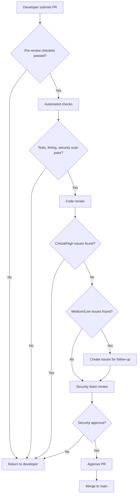

# Code Review Guidelines for Medical AI Systems
**Version:** 1.0
**Date:** 2025-11-11
**Applicable To:** AgnoMedicalAssistant Project

---

## 1. Overview

These code review guidelines are specifically designed for medical AI systems handling Protected Health Information (PHI) and sensitive personal data. All code must meet HIPAA, LGPD, and medical safety standards before merging to main branch.

---

## 2. Review Severity Levels

### 🔴 CRITICAL - BLOCKING
**Definition**: Issues that pose immediate risk to patient safety, data security, or regulatory compliance.

**Response Required**:
- MUST be fixed before merge
- NO exceptions allowed
- Requires security team review

**Examples**:
- Hardcoded credentials or API keys
- SQL injection vulnerabilities
- Missing authentication checks
- PHI exposure in logs
- Missing encryption for sensitive data
- AI outputs without confidence scoring
- Medical decisions without human oversight

---

### 🟠 HIGH - STRONGLY BLOCKING
**Definition**: Issues that significantly increase security, compliance, or safety risks.

**Response Required**:
- MUST be fixed before merge (rare exceptions with security team approval)
- Requires documented risk acceptance

**Examples**:
- Missing input validation
- Incomplete error handling
- Missing audit logging for PHI access
- Rate limiting not implemented
- Missing consent verification
- Inadequate hallucination mitigation

---

### 🟡 MEDIUM - SHOULD FIX
**Definition**: Issues that may lead to problems but don't pose immediate risk.

**Response Required**:
- SHOULD be fixed before merge
- Can be deferred with issue tracking
- Must be addressed within 30 days

**Examples**:
- Missing type hints
- Insufficient test coverage (<80%)
- Performance optimization opportunities
- Code duplication
- Missing documentation
- Non-critical security headers

---

### 🟢 LOW - NICE TO HAVE
**Definition**: Improvements that enhance code quality but don't affect functionality or security.

**Response Required**:
- Optional to fix
- Can be addressed in future PRs

**Examples**:
- Code style inconsistencies (if linter passes)
- Variable naming improvements
- Minor refactoring opportunities
- Additional comments for clarity

---

## 3. Medical AI Specific Review Criteria

### 3.1 AI Safety Checklist

Every AI-related code change MUST be reviewed for:

#### ✅ Confidence Scoring
```python
# ❌ CRITICAL: No confidence score
def diagnose_patient(symptoms):
    diagnosis = llm.generate(symptoms)
    return diagnosis

# ✅ CORRECT: Confidence score with validation
def diagnose_patient(symptoms):
    diagnosis = llm.generate(symptoms)
    confidence = calculate_confidence(diagnosis, symptoms)

    if confidence < MEDICAL_CONFIDENCE_THRESHOLD:
        return {
            "diagnosis": diagnosis,
            "confidence": confidence,
            "requires_human_review": True,
            "reason": "Low confidence score"
        }

    return {
        "diagnosis": diagnosis,
        "confidence": confidence,
        "requires_human_review": False
    }
```

**Review Questions**:
- [ ] Is confidence score calculated for all AI outputs?
- [ ] Is there a threshold for requiring human review?
- [ ] Is low confidence flagged and escalated?

---

#### ✅ Hallucination Detection
```python
# ❌ CRITICAL: No hallucination checks
def generate_treatment_plan(diagnosis):
    plan = llm.generate(f"Treatment for {diagnosis}")
    return plan

# ✅ CORRECT: Multi-layer validation
def generate_treatment_plan(diagnosis):
    plan = llm.generate(f"Treatment for {diagnosis}")

    # Layer 1: Evidence grounding
    has_evidence = check_evidence_grounding(plan, medical_knowledge_base)

    # Layer 2: Contradiction detection
    contradictions = detect_contradictions(plan)

    # Layer 3: Medical validation
    is_valid = validate_against_medical_guidelines(plan, diagnosis)

    if not (has_evidence and not contradictions and is_valid):
        return {
            "plan": plan,
            "status": "REQUIRES_VALIDATION",
            "issues": {
                "evidence_grounding": has_evidence,
                "contradictions": contradictions,
                "guideline_compliance": is_valid
            }
        }

    return {"plan": plan, "status": "VALIDATED"}
```

**Review Questions**:
- [ ] Is AI output validated against evidence?
- [ ] Are contradictions detected?
- [ ] Is output validated against medical guidelines?
- [ ] Is there a fallback for validation failures?

---

#### ✅ Human-in-the-Loop Requirements
```python
# ❌ CRITICAL: Automated medical decision without human oversight
@app.post("/prescribe-medication")
async def prescribe_medication(patient_id: str, symptoms: str):
    diagnosis = ai_diagnose(symptoms)
    medication = ai_prescribe(diagnosis)

    # DANGEROUS: Directly prescribing without physician review
    database.save_prescription(patient_id, medication)
    return {"medication": medication}

# ✅ CORRECT: Human review required for medical decisions
@app.post("/suggest-medication")
async def suggest_medication(
    patient_id: str,
    symptoms: str,
    current_user: User = Depends(require_physician_role)
):
    """AI suggests medication but requires physician approval"""

    diagnosis = ai_diagnose(symptoms)
    medication_suggestion = ai_prescribe(diagnosis)

    # Create pending approval record
    suggestion = MedicationSuggestion(
        patient_id=patient_id,
        suggested_medication=medication_suggestion,
        diagnosis=diagnosis,
        status="PENDING_PHYSICIAN_REVIEW",
        suggested_by_ai=True,
        confidence=medication_suggestion["confidence"]
    )

    database.save_suggestion(suggestion)

    # Notify physician for review
    await notify_physician(current_user.id, suggestion.id)

    return {
        "suggestion_id": suggestion.id,
        "medication": medication_suggestion,
        "status": "PENDING_REVIEW",
        "message": "Physician review required before prescribing"
    }

@app.post("/approve-medication")
async def approve_medication(
    suggestion_id: str,
    physician: User = Depends(require_physician_role)
):
    """Physician approves or modifies AI suggestion"""

    suggestion = database.get_suggestion(suggestion_id)

    # Physician can approve, modify, or reject
    prescription = Prescription(
        patient_id=suggestion.patient_id,
        medication=suggestion.suggested_medication,
        prescribed_by=physician.id,
        ai_assisted=True,
        approved_at=datetime.utcnow()
    )

    database.save_prescription(prescription)

    # Audit log
    audit_log.log_medical_decision(
        physician_id=physician.id,
        patient_id=suggestion.patient_id,
        decision="PRESCRIPTION_APPROVED",
        ai_assisted=True
    )

    return {"status": "APPROVED", "prescription_id": prescription.id}
```

**Review Questions**:
- [ ] Do all medical decisions require physician approval?
- [ ] Is there a clear audit trail of who approved what?
- [ ] Can AI suggestions be modified or rejected by physicians?
- [ ] Are patients informed when AI is involved in their care?

---

### 3.2 PHI Protection Checklist

#### ✅ PHI Detection and Anonymization
```python
# ❌ CRITICAL: PHI in logs
logger.info(f"Processing patient: {patient.name}, SSN: {patient.ssn}")

# ✅ CORRECT: PHI anonymized in logs
logger.info(
    "Processing patient",
    extra={
        "patient_id": patient.id,  # Use non-PHI identifier
        "action": "diagnosis_request"
    }
)

# ❌ CRITICAL: PHI in error messages
raise ValueError(f"Invalid data for patient {patient.name}")

# ✅ CORRECT: No PHI in error messages
raise ValueError(f"Invalid data for patient ID {patient.id}")
```

**Review Questions**:
- [ ] Are all logging statements free of PHI?
- [ ] Are error messages sanitized?
- [ ] Is PHI anonymized in monitoring/metrics?
- [ ] Are debug outputs disabled in production?

---

#### ✅ Access Control for PHI
```python
# ❌ CRITICAL: No access control check
@app.get("/patient/{patient_id}")
async def get_patient(patient_id: str):
    patient = database.get_patient(patient_id)
    return patient

# ✅ CORRECT: Access control with audit logging
@app.get("/patient/{patient_id}")
async def get_patient(
    patient_id: str,
    current_user: User = Depends(get_current_user)
):
    # Check authorization
    if not can_access_patient(current_user, patient_id):
        audit_log.log_access_denied(current_user.id, patient_id)
        raise HTTPException(
            status_code=403,
            detail="Not authorized to access this patient"
        )

    # Log PHI access
    audit_log.log_phi_access(
        user_id=current_user.id,
        patient_id=patient_id,
        action="READ",
        resource="patient_record"
    )

    patient = database.get_patient(patient_id)
    return patient
```

**Review Questions**:
- [ ] Is access control checked for all PHI endpoints?
- [ ] Is PHI access logged for audit purposes?
- [ ] Are access denials logged?
- [ ] Is principle of least privilege enforced?

---

### 3.3 Security Checklist

#### ✅ Input Validation
```python
# ❌ CRITICAL: No input validation
@app.post("/diagnose")
async def diagnose(symptoms: str):
    # Direct use of user input
    diagnosis = llm.generate(f"Diagnose: {symptoms}")
    return diagnosis

# ✅ CORRECT: Comprehensive validation
from pydantic import BaseModel, Field, validator
import bleach

class DiagnosisRequest(BaseModel):
    symptoms: str = Field(..., min_length=10, max_length=5000)
    patient_id: str = Field(..., regex=r"^[A-Z0-9]{8,12}$")

    @validator("symptoms")
    def sanitize_symptoms(cls, v):
        # Remove HTML tags
        sanitized = bleach.clean(v, tags=[], strip=True)

        # Check for SQL injection patterns
        if re.search(r"(\bUNION\b|\bSELECT\b|\bDROP\b)", sanitized, re.I):
            raise ValueError("Invalid characters in symptoms")

        return sanitized

@app.post("/diagnose")
async def diagnose(request: DiagnosisRequest):
    diagnosis = llm.generate(f"Diagnose: {request.symptoms}")
    return diagnosis
```

**Review Questions**:
- [ ] Are all inputs validated with Pydantic models?
- [ ] Are inputs sanitized to prevent injection attacks?
- [ ] Are file uploads validated (type, size, content)?
- [ ] Are length limits enforced?

---

#### ✅ SQL Injection Prevention
```python
# ❌ CRITICAL: SQL injection vulnerability
def get_patient_by_mrn(mrn: str):
    query = f"SELECT * FROM patients WHERE mrn = '{mrn}'"
    return database.execute(query)

# ✅ CORRECT: Parameterized query
from sqlalchemy import text

def get_patient_by_mrn(mrn: str):
    query = text("SELECT * FROM patients WHERE mrn = :mrn")
    return database.execute(query, {"mrn": mrn})

# ✅ EVEN BETTER: ORM
def get_patient_by_mrn(mrn: str):
    return database.query(Patient).filter_by(mrn=mrn).first()
```

**Review Questions**:
- [ ] Are all database queries parameterized?
- [ ] Is ORM used instead of raw SQL where possible?
- [ ] Are dynamic queries avoided?
- [ ] Is user input never concatenated into SQL?

---

#### ✅ Authentication and Authorization
```python
# ❌ CRITICAL: No authentication
@app.post("/patient-data")
async def save_patient_data(data: dict):
    database.save(data)
    return {"status": "saved"}

# ✅ CORRECT: Authentication and authorization
from fastapi import Depends, HTTPException
from jose import jwt

async def get_current_user(token: str = Depends(oauth2_scheme)) -> User:
    try:
        payload = jwt.decode(token, SECRET_KEY, algorithms=["HS256"])
        user_id = payload.get("sub")
        user = await get_user_from_db(user_id)
        if not user:
            raise HTTPException(status_code=401, detail="Invalid token")
        return user
    except JWTError:
        raise HTTPException(status_code=401, detail="Invalid token")

def require_role(allowed_roles: list[str]):
    def role_checker(current_user: User = Depends(get_current_user)):
        if current_user.role not in allowed_roles:
            raise HTTPException(status_code=403, detail="Insufficient permissions")
        return current_user
    return role_checker

@app.post("/patient-data")
async def save_patient_data(
    data: dict,
    current_user: User = Depends(require_role(["physician", "nurse"]))
):
    database.save(data)
    audit_log.log_data_modification(current_user.id, "patient_data_saved")
    return {"status": "saved"}
```

**Review Questions**:
- [ ] Is authentication required for all protected endpoints?
- [ ] Is role-based access control (RBAC) implemented?
- [ ] Are tokens validated and not expired?
- [ ] Is authorization checked before data access?

---

#### ✅ Secrets Management
```python
# ❌ CRITICAL: Hardcoded secrets
API_KEY = "sk-1234567890abcdef"
DATABASE_PASSWORD = "admin123"

# ✅ CORRECT: Environment variables
import os

API_KEY = os.getenv("GROQ_API_KEY")
DATABASE_PASSWORD = os.getenv("DB_PASSWORD")

if not API_KEY:
    raise ValueError("GROQ_API_KEY environment variable not set")

# ✅ EVEN BETTER: Secrets manager
from azure.keyvault.secrets import SecretClient
from azure.identity import DefaultAzureCredential

credential = DefaultAzureCredential()
client = SecretClient(vault_url=VAULT_URL, credential=credential)

API_KEY = client.get_secret("groq-api-key").value
```

**Review Questions**:
- [ ] Are all secrets loaded from environment variables or secrets manager?
- [ ] Are there NO hardcoded credentials in code?
- [ ] Is `.env` in `.gitignore`?
- [ ] Is `.env.example` provided without real secrets?

---

### 3.4 Code Quality Checklist

#### ✅ Type Hints
```python
# ❌ MEDIUM: No type hints
def calculate_risk(patient_data):
    score = 0
    for condition in patient_data["conditions"]:
        score += condition["severity"]
    return score

# ✅ CORRECT: Comprehensive type hints
from typing import List, Dict

def calculate_risk(patient_data: Dict[str, List[Dict[str, int]]]) -> float:
    """Calculate patient risk score based on conditions"""
    score: float = 0.0
    for condition in patient_data["conditions"]:
        score += condition["severity"]
    return score

# ✅ EVEN BETTER: Pydantic models
from pydantic import BaseModel

class Condition(BaseModel):
    name: str
    severity: int

class PatientData(BaseModel):
    conditions: List[Condition]

def calculate_risk(patient_data: PatientData) -> float:
    """Calculate patient risk score based on conditions"""
    return sum(condition.severity for condition in patient_data.conditions)
```

**Review Questions**:
- [ ] Do all functions have type hints for parameters and return values?
- [ ] Are complex types defined with TypedDict or Pydantic models?
- [ ] Does `mypy --strict` pass without errors?

---

#### ✅ Error Handling
```python
# ❌ HIGH: Bare except clause
try:
    result = process_patient_data(data)
except:
    return "Error"

# ✅ CORRECT: Specific exceptions with logging
from fastapi import HTTPException
import structlog

logger = structlog.get_logger()

try:
    result = process_patient_data(data)
except ValidationError as e:
    logger.error("Data validation failed", error=str(e), data=data)
    raise HTTPException(status_code=422, detail="Invalid patient data")
except DatabaseError as e:
    logger.error("Database error", error=str(e))
    raise HTTPException(status_code=500, detail="Internal server error")
except Exception as e:
    logger.exception("Unexpected error", error=str(e))
    raise HTTPException(status_code=500, detail="Internal server error")
```

**Review Questions**:
- [ ] Are specific exceptions caught instead of bare `except:`?
- [ ] Are errors logged with appropriate detail?
- [ ] Are user-facing error messages sanitized (no stack traces)?
- [ ] Is there a global exception handler?

---

#### ✅ Test Coverage
```python
# ❌ MEDIUM: No tests
def diagnose_patient(symptoms: str) -> str:
    # Complex logic with no tests
    pass

# ✅ CORRECT: Comprehensive tests
import pytest

def test_diagnose_patient_valid_symptoms():
    """Test diagnosis with valid symptoms"""
    result = diagnose_patient("fever, cough, fatigue")
    assert result["diagnosis"] is not None
    assert result["confidence"] > 0

def test_diagnose_patient_low_confidence():
    """Test that low confidence requires human review"""
    result = diagnose_patient("unclear symptoms")
    assert result["requires_human_review"] is True

def test_diagnose_patient_validates_input():
    """Test input validation"""
    with pytest.raises(ValidationError):
        diagnose_patient("")  # Empty input

def test_diagnose_patient_handles_errors():
    """Test error handling"""
    with pytest.raises(DiagnosisError):
        diagnose_patient("invalid data" * 1000)  # Too long
```

**Review Questions**:
- [ ] Is test coverage >80% for critical paths?
- [ ] Are edge cases tested?
- [ ] Are error conditions tested?
- [ ] Are integration tests present for API endpoints?

---

## 4. Review Process

### 4.1 Pre-Review Checklist (Author)

Before submitting PR, author MUST verify:

- [ ] All tests pass locally
- [ ] Code passes linting (`ruff check`)
- [ ] Code passes type checking (`mypy --strict`)
- [ ] No hardcoded secrets or credentials
- [ ] No PHI in logs or error messages
- [ ] All PHI access has authorization checks
- [ ] All AI outputs have confidence scoring
- [ ] Medical decisions require human approval
- [ ] Documentation updated
- [ ] Changelog updated
- [ ] Self-review completed

---

### 4.2 Reviewer Checklist

Reviewers MUST check:

#### Security Review
- [ ] No hardcoded secrets
- [ ] Input validation present
- [ ] SQL injection prevention
- [ ] XSS prevention
- [ ] Authentication/authorization correct
- [ ] PHI protection adequate
- [ ] Audit logging present

#### Medical AI Safety Review
- [ ] Confidence scoring implemented
- [ ] Hallucination detection present
- [ ] Human-in-the-loop for medical decisions
- [ ] Evidence grounding verified
- [ ] Medical guideline compliance

#### Code Quality Review
- [ ] Type hints present
- [ ] Error handling adequate
- [ ] Test coverage sufficient (>80%)
- [ ] Documentation clear
- [ ] Code follows style guide
- [ ] No code duplication

#### Compliance Review
- [ ] HIPAA requirements met
- [ ] LGPD requirements met
- [ ] Consent management correct
- [ ] Data retention policy followed
- [ ] Audit logging complete

---

### 4.3 Review Workflow



---

### 4.4 Review Response Times

| Priority | Response Time | Resolution Time |
|----------|--------------|-----------------|
| 🔴 CRITICAL | <2 hours | <1 day |
| 🟠 HIGH | <1 day | <3 days |
| 🟡 MEDIUM | <2 days | <1 week |
| 🟢 LOW | <1 week | Next sprint |

---

## 5. Automated Checks

### 5.1 Pre-commit Hooks

```yaml
# .pre-commit-config.yaml
repos:
  - repo: https://github.com/astral-sh/ruff-pre-commit
    rev: v0.2.0
    hooks:
      - id: ruff
        args: [--fix, --exit-non-zero-on-fix]

  - repo: https://github.com/psf/black
    rev: 24.1.0
    hooks:
      - id: black

  - repo: https://github.com/pre-commit/mirrors-mypy
    rev: v1.8.0
    hooks:
      - id: mypy
        args: [--strict]

  - repo: https://github.com/PyCQA/bandit
    rev: 1.7.7
    hooks:
      - id: bandit
        args: [-ll, -r, src/]

  - repo: https://github.com/trufflesecurity/trufflehog
    rev: v3.63.0
    hooks:
      - id: trufflehog
        args: [--no-update, filesystem, --directory, .]
```

---

### 5.2 CI/CD Pipeline Checks

```yaml
# .github/workflows/security.yml
name: Security Checks

on: [pull_request]

jobs:
  security:
    runs-on: ubuntu-latest
    steps:
      - uses: actions/checkout@v4

      - name: Run Bandit security scan
        run: bandit -r src/ -ll

      - name: Run Trivy vulnerability scanner
        uses: aquasecurity/trivy-action@master

      - name: Run OWASP Dependency Check
        uses: dependency-check/Dependency-Check_Action@main

      - name: Scan for secrets
        uses: trufflesecurity/trufflehog@main

      - name: Run SAST with Semgrep
        uses: returntocorp/semgrep-action@v1
```

---

## 6. Common Issues and Fixes

### 6.1 PHI Exposure in Logs

**Issue**:
```python
logger.info(f"Patient {patient.name} diagnosed with {diagnosis}")
```

**Fix**:
```python
logger.info(
    "Patient diagnosed",
    extra={
        "patient_id": patient.id,
        "diagnosis_code": diagnosis.code,
        "timestamp": datetime.utcnow()
    }
)
```

---

### 6.2 Missing Confidence Scores

**Issue**:
```python
diagnosis = ai_model.predict(symptoms)
return diagnosis
```

**Fix**:
```python
diagnosis, confidence = ai_model.predict_with_confidence(symptoms)

if confidence < CONFIDENCE_THRESHOLD:
    return {
        "diagnosis": diagnosis,
        "confidence": confidence,
        "requires_review": True
    }

return {
    "diagnosis": diagnosis,
    "confidence": confidence,
    "requires_review": False
}
```

---

### 6.3 Hardcoded Secrets

**Issue**:
```python
api_key = "sk-1234567890"
```

**Fix**:
```python
import os

api_key = os.getenv("API_KEY")
if not api_key:
    raise ValueError("API_KEY environment variable not set")
```

---

## 7. Review Templates

### 7.1 Approval Template

```markdown
## Code Review Approval

✅ **APPROVED**

### Summary
[Brief description of changes]

### Security Review
- ✅ No hardcoded secrets
- ✅ Input validation present
- ✅ Authentication checks correct
- ✅ PHI protection adequate

### Medical AI Safety
- ✅ Confidence scoring implemented
- ✅ Human review required for medical decisions
- ✅ Hallucination detection present

### Code Quality
- ✅ Type hints present
- ✅ Tests pass (coverage: 87%)
- ✅ Documentation updated

### Compliance
- ✅ HIPAA requirements met
- ✅ LGPD requirements met

**Reviewer**: [Name]
**Date**: [Date]
```

---

### 7.2 Request Changes Template

```markdown
## Code Review - Changes Requested

### 🔴 CRITICAL Issues (MUST FIX)

1. **Hardcoded API Key** (Line 45)
   - **Issue**: API key hardcoded in source
   - **Risk**: Credential exposure
   - **Fix**: Use environment variable or secrets manager
   ```python
   # Replace this:
   api_key = "sk-1234"

   # With this:
   api_key = os.getenv("API_KEY")
   ```

### 🟠 HIGH Priority Issues (SHOULD FIX)

1. **Missing PHI Access Logging** (Line 123)
   - **Issue**: PHI access not logged
   - **Risk**: HIPAA violation
   - **Fix**: Add audit logging
   ```python
   audit_log.log_phi_access(user_id, patient_id, action="READ")
   ```

### 🟡 MEDIUM Priority Issues

1. **Missing Type Hints** (Multiple locations)
   - Add type hints to all functions

### Comments
[Additional feedback]

**Reviewer**: [Name]
**Date**: [Date]
```

---

## 8. Training and Resources

### 8.1 Required Training

All reviewers MUST complete:
- [ ] HIPAA Security Rule training
- [ ] LGPD fundamentals training
- [ ] Secure coding practices
- [ ] Medical AI safety principles
- [ ] Code review best practices

### 8.2 Reference Materials

- OWASP Top 10: https://owasp.org/Top10/
- HIPAA Security Rule: https://www.hhs.gov/hipaa/for-professionals/security/
- LGPD Full Text: https://www.gov.br/anpd/pt-br/assuntos/lgpd
- Python Security Best Practices: https://python.readthedocs.io/en/stable/library/security_warnings.html

---

## Document Control

- **Version**: 1.0
- **Last Updated**: 2025-11-11
- **Next Review**: 2025-12-11
- **Owner**: Security & Compliance Review Agent

---

**END OF CODE REVIEW GUIDELINES**
